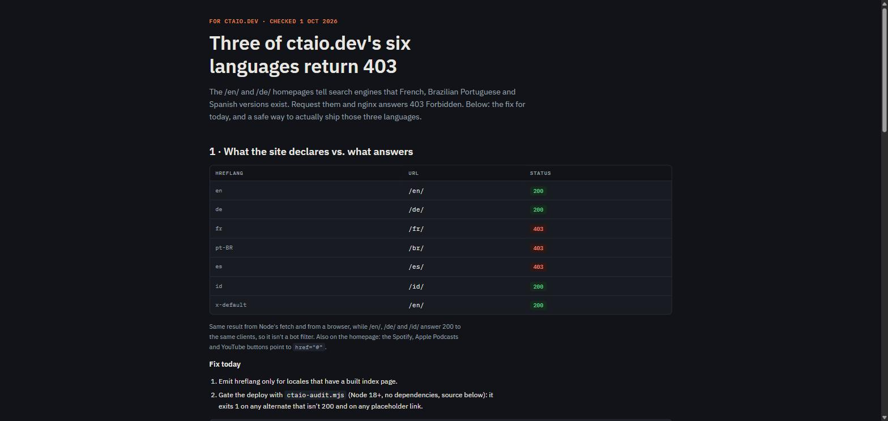
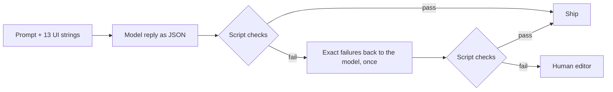
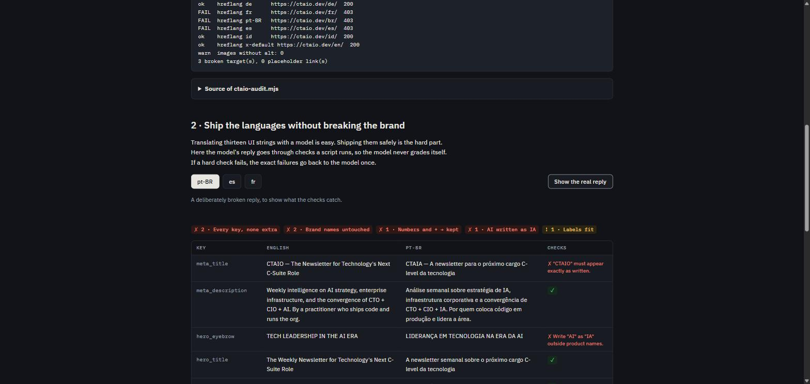

# CTAIO Locale Rescue

**ctaio.dev tells search engines it speaks French, Brazilian Portuguese and Spanish. Those pages answer `403`.**

This repo has the fix for today, and a safe way to actually ship those three languages with AI: the model writes the translations, a script decides whether they ship.

**[▶ Open the live page](https://j4kedi.github.io/ctaio-locale-rescue/)** · Node 18+ · zero dependencies · built in one sitting with Claude Code



## The finding

Checked on 1 Oct 2026, from Node and from a browser:

| hreflang | URL | Status |
| --- | --- | --- |
| `en` | `/en/` | ✅ 200 |
| `de` | `/de/` | ✅ 200 |
| `fr` | `/fr/` | ❌ **403** |
| `pt-BR` | `/br/` | ❌ **403** |
| `es` | `/es/` | ❌ **403** |
| `id` | `/id/` | ✅ 200 |

`/en/`, `/de/` and `/id/` answer 200 to the same clients, so the 403s aren't a bot filter. Also on the homepage: the Spotify, Apple Podcasts and YouTube buttons point to `href="#"`.

## 1 · Fix today: `ctaio-audit.mjs`

Emit hreflang only for locales that have a built index page. Then keep it fixed by running the audit in the deploy:

```bash
node ctaio-audit.mjs https://ctaio.dev/en/   # exit 1 on a broken alternate or an href="#" link
node ctaio-audit.mjs --self-test
```

<details>
<summary>Output on 1 Oct 2026</summary>

```text
https://ctaio.dev/en/ -> 200
ok    canonical        https://ctaio.dev/en/  200
ok    hreflang en      https://ctaio.dev/en/  200
ok    hreflang de      https://ctaio.dev/de/  200
FAIL  hreflang fr      https://ctaio.dev/fr/  403
FAIL  hreflang pt-BR   https://ctaio.dev/br/  403
FAIL  hreflang es      https://ctaio.dev/es/  403
ok    hreflang id      https://ctaio.dev/id/  200
ok    hreflang x-default https://ctaio.dev/en/  200
warn  images without alt: 0
3 broken target(s), 0 placeholder link(s)
```

</details>

## 2 · Ship the languages: AI translation, checked by a script

Translating 13 UI strings with a model is easy. Shipping them without breaking the brand is the hard part, so the model never grades itself:



| Check | Type | What it catches |
| --- | --- | --- |
| Every key, none extra | hard | dropped or invented strings |
| Brand names untouched | hard | `CTAIA`, `Weekly IA Edge` |
| Numbers and `+` `→` kept | hard | "Guia salarial de CTO" losing `(2026)` |
| "AI" written as "IA" | hard | `…NA ERA DA AI` |
| Labels fit | soft | a nav label much longer than the English |



Two details that matter:

- Brand names are matched longest first, so `CTAIO Labs` is consumed before `CTAIO`.
- "AI" is matched with Unicode-aware lookarounds, because JavaScript's `\b` only knows ASCII letters.

The full prompt for each language is on the [live page](https://j4kedi.github.io/ctaio-locale-rescue/), with a copy button. Opened inside a Claude artifact viewer, the page also has a live mode that runs the prompt on the viewer's own Claude account.

## Files

| File | What it does |
| --- | --- |
| `ctaio-audit.mjs` | hreflang, canonical and placeholder-link audit (CLI) |
| `core.js` | prompt builder, validator, repair prompt, sample replies |
| `test.cjs` | samples pass every hard check; six planted mistakes trip exactly six |
| `index.html` | the page |

```bash
node test.cjs
```

## Next, with more time

- Audit every URL in the sitemap, and check that each alternate links back.
- Run 20 live replies per language; track first-pass rate, repair rate and cost.
- Learn the site's existing choices from `/de/` and `/id/` (what stays in English, tone) and turn them into the glossary.
- Wire the audit into the real deploy pipeline.

---

Built by [Kauan Pardini Augusto](https://github.com/J4kedi) with Claude Code (Opus 5.5), 1 Oct 2026.
